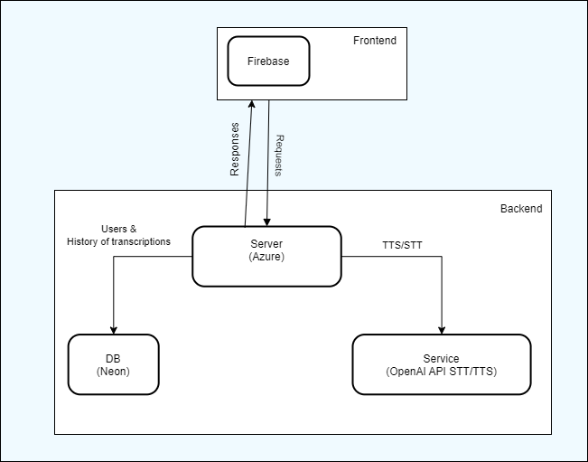

<h1 align="center">⏳ &lt;TTS/STT&gt; ⏳</h1>

<h3>Zhrnutie:</h3>

&emsp;&emsp;V tomto projekte sme vytvorili webovú službu na konverziu textu na reč (Text‑to‑Speech) a reči na text (Speech‑to‑Text). Používatelia sa môžu registrovať, prihlásiť, meniť avatar a používateľské meno, vyberať tému rozhrania (svetlá/tmavá) a prezerať históriu svojich TTS/STT požiadaviek. Pri konverzii textu na reč sú k dispozícii nastavenia hlasu, rýchlosti a formátu výstupného audio súboru. Pri rozpoznávaní reči služba vracia text a detegovaný jazyk z nahraného audio súboru.

<h3>Použité technológie:</h3>

- ☁️ **Azure** — nasadenie backendu  
- 🗄️ **Neon** — hosting databázy  
- 🚀 **Firebase** — nasadenie frontendu  
- 🤖 **OpenAI Speech‑to‑Text/Text‑to‑Speech API** — konverzia reči a textu  

<h3>Diagram architektúry:</h3>

 

 

Používateľ odošle text alebo audio prostredníctvom webového rozhrania → požiadavka sa spracuje na backende v Azure → pri TTS sa parametre (hlas, rýchlosť, formát) odošlú do OpenAI API → výsledný audio súbor sa uloží a vráti používateľovi; pri STT sa audio odošle do OpenAI API → vrátený text a jazyk sa uložia a zobrazia používateľovi. Všetky požiadavky a odpovede sa logujú v Neon DB v prepojení s používateľským účtom.

<h3>Rozdelenie práce:</h3>

- 🙍‍♂️ **Y. Zhuravskyi** — frontend(basic template , logout if token expired , contant variable from git , bug fix) , deploy(host) on FireBase
- 🙍‍♀️ **M. Paik** —  Open AI TTS/STT integration, transcrpiptions history
- 🙍‍♂️ **P. Smitiuk** —   frontend (custom TTS/STT UI with sidebar history & profile modal, voice‑preview, bug‑fixes)
- 🙍‍♂️ **O. Shtefan** — Create DB, deploy server app on Azure, auth logic, small fixes

<h3>Návod na použitie:</h3>

1. Zaregistrujte sa alebo sa prihláste.  
2. V ľavom hornom rohu vyberte režim: **Text‑to‑Speech** alebo **Speech‑to‑Text**.  
3. Pre TTS: zadajte text, nastavte hlas, rýchlosť a formát, kliknite na „“ a stiahnite si vzniknuté audio.  
4. Pre STT: nahrajte audio súbor a získajte text + informácie o jazyku.  
5. História všetkých vašich požiadaviek je dostupná v sekcii „Moje požiadavky“.  
6. Ak chcete zmeniť tému rozhrania, kliknite na ikonu „Téma“ v pravom hornom rohu.  

---
